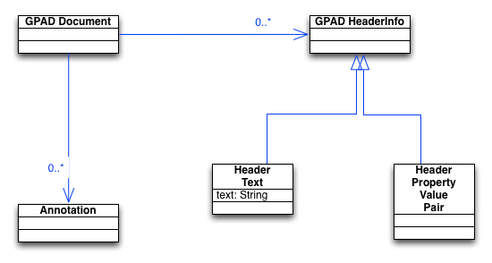
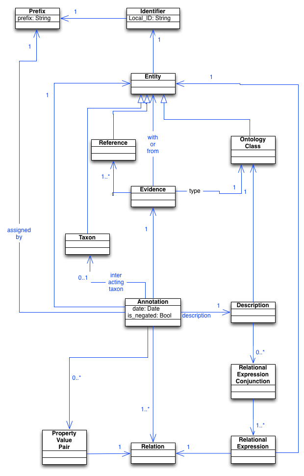
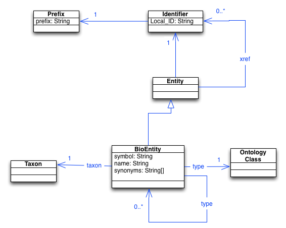

# Proposed specifications for Gene Ontology Consortium GPAD and GPI tabular formats version 2.0

## Abstract
This document specifies the syntax of Gene Product Annotation Data (GPAD) and Gene Product Information (GPI) formats. GPAD describes the relationships between biological entities (such as gene products) and biological descriptors (such as GO terms). GPI describes the biological entities.

## Status
This is a working draft, intended for comment by the community.
Comments should be sent to go-discuss AT geneontology.org

## Summary of changes relative to 1.2
  - columns 1 and 2 are now combined in both GPAD and GPI to form a single column containing an id in CURIE syntax, e.g. UniProtKB:P56704
  - In GPAD, negation is captured in a separate column, column 2, using the text string 'NOT'
  - In GPAD, the gene product-to-term relation captured in column 3 now uses a Relations Ontology (RO) identifier instead of a text string
  - In GPAD, the Reference column, column 5, is now a single value field.
  - In GPAD, the With/From column, column 7, may contain identifiers separated by commas as well as pipes.
  - In GPAD and GPI - anything to change about taxon id, i.e. NCBI:txid6239
  - In GPAD, Annotation_Extensions in column 11 use a Relation_ID, rather than a Relation_Symbol, in the Relational_Expression.
  - GPAD Standard set of properties: ##Still need to agree on these
    annotation_id ("id"), "curator_name" (DC_Author),
    "go_evidence" (shorthand), comment
  - In GPI, the entity type in column 6 is capture using an ID from the Sequence Ontology.  
  - GPI properties:  ##Still need to agree on these
    DB_Subset (swissprot vs tremble),
    Annotation_Complete (Date), slim/subset type of thing
  - file names: *.gpa (also accepted *.gpad) and *.gpi ##Are we just going with .gpad and .gpi?
  
# Outline

We first start with some preliminary definitions, including a
description of the notation used in this specification.

The body of the document is split in two - the first part defines GPAD
syntax, the second defines GPI syntax.

## Preliminary Definitions

### UML Notation

This document uses only a very simple form of UML class diagrams that
are expected to be easily understandable by readers familiar with the
basic concepts of object-oriented systems.

*TODO* - move UML elsewhere

### BNF Notation

GPAD and GPI document structures are defined using a standard BNF notation, which is summarized below.

 * terminal symbols are single quoted
 * non-terminal symbols are unquoted
 * zero or more symbols are indicated by following the symbol with a star; e.g. `Annotation*`
 * zero or one symbols are written using square brackets; e.g. `[Extension_Conj]`
 * alternative symbols are written using vertical bars
 * groupings are written using parentheses
 * complementation is written using minus symbol

GPI and GPAD documents consist of sequences of Unicode characters and are encoded in ASCII.

### Basic Characters

    Alpha_Char ::= a |b |c |d |e |f |g |h |i |j |k |l |m |n |o |p |q |r |s |t |u |v |w |x |y |z
       | A |B |C |D |E |F |G |H |I |J |K |L |M |N |O |P |Q |R |S |T |U |V |W |X |Y |Z
    Digit ::= 0 |1 |2 |3 |4 |5 |6 |7 |8 |9
    Alphanumeric_Char ::= Alpha_Char | Digit

### Spacing Characters

There is a single space character allowed

    Space ::= ' '

### Identifiers

An identifier consists of a prefix and a local identifier separated by a colon symbol

    ID ::= Prefix ':' Local_ID

A Prefix must not contain special characters such as ':'s

    Prefix ::= Alphanumeric | '_' | '-'

A local identifier can consist of any non-whitespace character

    Local_ID ::= (Any_ASCII_Character - ws)

An OBO ID is a type of identifier

    OBO_ID ::= ID

OBO identifiers (which include GO identifiers) SHOULD follow the [OBO identifier policy](http://www.obofoundry.org/id-policy.shtml)

References are also types of identifier

    Reference ::= ID

### GO database registry

The [GO database
registry](https://github.com/geneontology/go-site/blob/master/metadata/db-xrefs.yaml) contains a
list of valid prefixes that can be used in GPAD or GPI files. Every
identifier used in a GPAD or GPI file SHOULD have an entry in the
registry.

The combination of prefix plus Local_ID (see previous section)
describes how an identifier should be mapped to a URI.

### Property Symbols

Open-ended property-value pairs are allowed at different points
throughout a document. The property symbol or "tag" is a shorthand way
of specifying a URI that denotes the actual property used.

    Property_Symbol ::= ID | Alphanumeric

### Dates

Dates are written into what is equivalent to the date portion of ISO-8601, omitting hyphens:

    YYYYMMDD ::= Year Month Day_of_month
    Year ::= digit digit digit digit
    Month ::= digit digit
    Day_of_month ::= digit digit

Both months and days count from 1. E.g. Jan=1, first day of month=1.

A Date is equivalent to an
[xsd:date](http://www.w3.org/TR/xmlschema11-2/#date), and inherits the
same semantics and constraints.

## GPAD Syntax

### GPAD Document Structure

A GPAD document consists of a header followed by zero or more
annotations

    GPAD_Doc ::= GPAD_Header Annotation*

This is illustrated in the following UML diagram:

### GPAD Headers

A header consists of an obligatory format version declaration followed
by zero or more metadata lines:

    GPAD_Header ::= '!gpa-version: 2.0' nl
                    GPAD_Header_Line*

Each metadata line starts with an exclamation mark '!'. One mark
indicates a structured tag-value pair, two marks indicates free text.

    GPAD_Header_Line ::=
       '!' Property_Symbol ':' Space* Value nl |
       '!!' (Char - nl)* nl

The list of allowed property symbols is open-ended and outside the
scope of this specification. Different groups may decide on their own
conventions. Examples include:

 * Project_name: E.g. SGD
 * URL: E.g. http://www.yeastgenome.org/
 * Funding: e.g. NHGRI
 * Date: an ISO-8601 formatted date describing when the file was produced

### Annotations

In this specification, an annotation is an association between a
biological entity (such as a gene or gene product) and an ontology
class (term). The association describes some aspect of that entity,
and includes with metadata about the association, such as evidence and
provenance.

Each annotation is on a separate line of tab separated values:

    Annotation ::= Col_1 tab Col_2 tab ... Col_12 nl

## GPAD columns

 Each of these columns has its own syntax, as specified below:
 
 Column 	| Content 	| Comments
--------|----------|-----------
 1 | DB_Object_ID ::= ID   |   
 2 | Negation ::= 'NOT'     | 
 3 | Relation ::= OBO_ID        | 
 4 | Ontology_Class_ID ::= OBO_ID     | 
 5 | Reference ::= ID      | 
 6 | Evidence_type ::= OBO_ID     | 
 7 | With_or_From ::= [ID] ('\|' \| ‘,’ ID)*     | 
 8 | Interacting_taxon_ID ::= NCBI:txid[Taxon_ID] | Will this break too many things if we make this a CURIE?
 9 | Date ::= YYYYMMDD     | 
10 | Assigned_by ::= Prefix     | 
11 | Annotation_Extensions ::= [Extension_Conj] ('\|' Extension_Conj)*       |   
12 | Annotation_Properties ::= [Property_Value_Pair] ('\|' Property_Value_Pair)*     | 

Extension_Conj ::= [Relational_Expression] (',' Relational_Expression)*
Relational_Expression ::= Relation_ID '(' ID ')'

Property_Value_Pair ::= Property_Symbol '=' Property_Value
Property_Value  ::= (AnyChar - ('=' | '|' | nl))
    
    
# GPI 2.0 Specs 

## GPI Headers

A header consists of an obligatory format version declaration followed
by an obligator database declaration then zero or more lines starting
with an exclamation point:

    GPI_Header ::= '!gpi-version: 1.1' nl
                   '!namespace: ' Prefix nl
                   Header_Line*

Each metadata line starts with an exclamation mark '!'. One mark
indicates a structured tag-value pair, two marks indicates free text.

    GPI_Header_Line ::=
       '!' Property_Symbol ':' Space* Value nl |
       '!!' (Char - nl)* nl
       
## GP Entities

A GP entity is any biological entity that can be annotated using GPAD

Each entity is written on a separate line of tab separated values:

    Entity ::= Col_1 tab Col_2 tab ... Col_9 nl
       
## GPI Columns

 Column 	| Content 	| Comments
--------|----------|-----------
1 | DB_Object_ID ::= ID      | 
2 | DB_Object_Symbol ::= xxxx     | 
3 | DB_Object_Name ::= xxxx     | 
4 | DB_Object_Synonyms ::= [Label] ('\|' Label)*     | 
5 | DB_Object_Type ::= OBO_ID     | 
6 | DB_Object_Taxon ::= NCBI:txid[Taxon_ID]     |  As for GPAD, will making this a CURIE break too many things?
7 | Parent_ObjectID ::= [ID] ('\|' ID)*      |  Need to be clear on what is meant by 'parent'.  Also, what is intended by the pipe here?
8 | DB_Xrefs ::= [ID] ('\|' ID)*      |  Also need to be clear on what is required, e.g. MOD gene IDs xref to UniProtKB GCRP.
9 | Properties ::= [Property_Value_Pair] (',' Property_Value_Pair)*     | 

    
